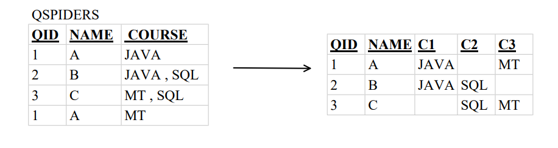
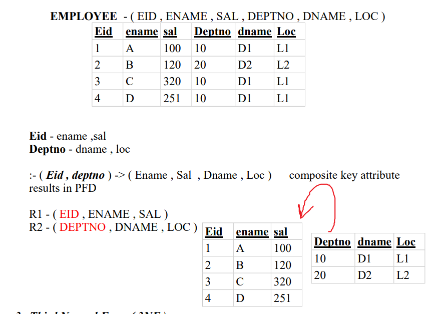
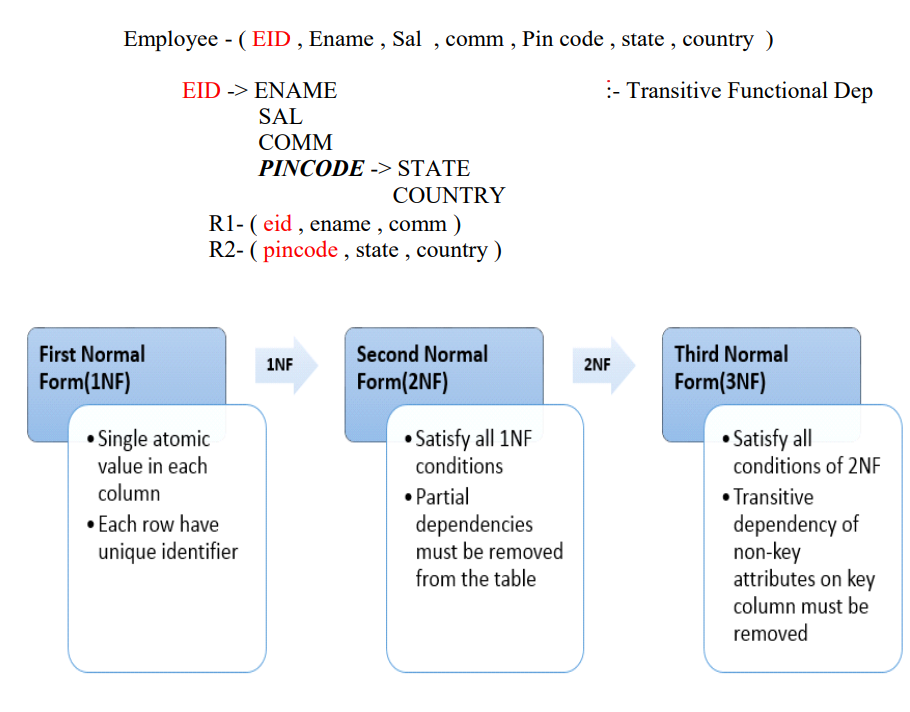

# Normalization

**It is the process of reducing a large table into smaller tables in order to remove redundancies and anomalies by identifying their functional dependencies is known as Normalization .** 

Or

**The process of decomposing a large table into smaller table is known as Normalization**

Or

**Reducing a table to its Normal Form is known as Normalization .**

or

**The process of decomposing larger table into smaller table.**

**It is process of reducing of larger table into small table.**

**By identifing there functional dependencies.**

**What is Normal Form ?**

- A table without redundancies and anomalies are said to be in Normal Form . 

**Functional Dependencies:**

- fully 👍
- partial
- transitive

**Levels of Normal From .**

1. First Normal Form ( 1NF )
2. Second Normal Form ( 2NF )
3. Third Normal Form ( 3NF )
4. Boyce - Codd Normal Form ( BCNF ) 

**Note : If any Table / entity is reduced to 3NF , then the table is said to be normalized.**

### 1. First Normal Form ( 1NF ) :
---
 - No duplicates records .
 - Multivalued data should not be present .

### 2. Second Normal Form ( 2NF )

 - Table should be in 1NF
 - Table should not have Partial Functional Dependency .

### 3. ( 3NF )
 - Table should be in 2NF .
 - Table should not have Transitive Functional Dependency . 

### BCNF

It is updated version of 3nf.